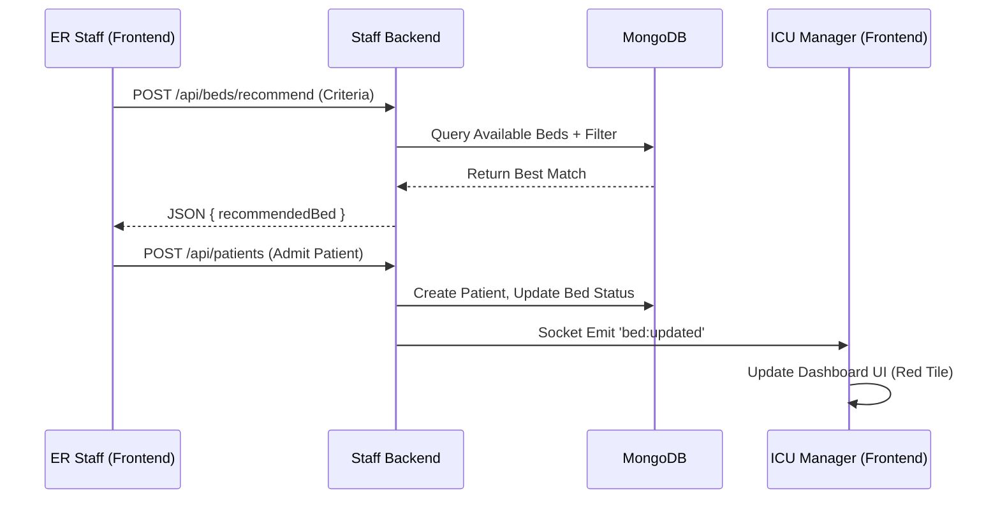

# 📘 Low-Level Design (LLD) - Hospital Management System

This document details the low-level logic and implementation of the operational storyline, mapping user roles and workflows to specific codebase files, API endpoints, and logic flows.

---

## 1️⃣ ICU MANAGER (ANURADHA) — “The Central Navigator”

### Step 1: Login & System Initialization
**Goal**: Authenticate and load real-time dashboard.

*   **Frontend Logic**:
    *   **Component**: `Login.jsx` (`staff-frontend/src/pages/Login.jsx`)
    *   **Action**: Submits credentials to `POST /api/auth/login`.
    *   **State**: Stores JWT token in `localStorage` or `cookie`.
    *   **Redirect**: Navigates to `/dashboard`.
*   **Backend Logic**:
    *   **Route**: `staff-backend/routes/auth.js` -> `router.post('/login', ...)`
    *   **Controller**: Verifies email/password using `bcrypt`. Generates JWT with role `ICU_MANAGER`.
*   **Real-Time Initialization**:
    *   **Component**: `App.jsx` / `SocketContext.jsx`
    *   **Logic**: Establishes Socket.IO connection to `http://localhost:5001`.
    *   **Event Listener**: Listens for `bed:updated`, `patient:admitted`, `alert:created`.

### Step 2: Monitoring Live Status
**Goal**: View ward-wise bed counts and individual bed details.

*   **Frontend Logic**:
    *   **Component**: `Dashboard.jsx` (`staff-frontend/src/pages/Dashboard.jsx`)
    *   **Data Fetching**: Calls `GET /api/dashboard/overview` and `GET /api/beds`.
    *   **Rendering**: Maps through bed data to render `BedCard` components.
    *   **Visuals**: Uses conditional CSS classes based on `bed.status` (e.g., `bg-green-100` for available).
*   **Backend Logic**:
    *   **Route**: `staff-backend/routes/dashboard.js` -> `router.get('/overview', ...)`
    *   **Query**: Aggregates counts from `Bed` model: `{ status: 'occupied' }`, `{ status: 'available' }`.
    *   **Route**: `staff-backend/routes/beds.js` -> `router.get('/', ...)`
    *   **Query**: `Bed.find().populate('ward').populate('currentPatient')`.

### Step 3: Emergency Bed Allocation
**Goal**: System recommends bed for emergency request.

*   **Frontend Logic**:
    *   **Component**: `BedRecommendationModal.jsx` (triggered by ER request).
    *   **Action**: Calls `POST /api/beds/recommend`.
*   **Backend Logic**:
    *   **Route**: `staff-backend/routes/beds.js` -> `router.post('/recommend', ...)`
    *   **Service**: `utils/bedRecommendation.js` -> `recommendBed()`.
    *   **Algorithm**:
        1.  Finds all `available` beds in requested `wardType`.
        2.  Filters beds matching `equipmentType` (e.g., 'Ventilator').
        3.  Sorts by priority (e.g., ICU beds for Critical patients).
        4.  Returns top match + 2 alternatives.

### Step 4: Managing Admissions & Transfers
**Goal**: Admit patients and manage bed assignments.

*   **Frontend Logic**:
    *   **Component**: `AdmissionForm.jsx`.
    *   **Action**: Submits patient data to `POST /api/patients`.
*   **Backend Logic**:
    *   **Route**: `staff-backend/routes/patients.js` -> `router.post('/', ...)`
    *   **Transaction**:
        1.  Creates `Patient` document.
        2.  Updates `Bed` status to `occupied`.
        3.  Links `patient._id` to `Bed` and `bed._id` to `Patient`.
        4.  Emits `bed:updated` and `patient:admitted` via Socket.IO.

### Step 5: Alerts & Threshold Warnings
**Goal**: Notify manager of critical states.

*   **Backend Logic**:
    *   **Service**: `services/alertService.js` -> `checkOccupancyThreshold()`.
    *   **Trigger**: Called after every bed status update (`bed:updated`).
    *   **Logic**:
        *   Calculate `occupancyRate = (occupied / total) * 100`.
        *   If `occupancyRate > 90`, create `Alert` document.
        *   Emit `alert:occupancy` socket event.
*   **Frontend Logic**:
    *   **Component**: `AlertBanner.jsx` / `ToastContainer`.
    *   **Action**: Displays red banner/toast when `alert:occupancy` event is received. Plays sound cue.

### Step 6: Forecasting
**Goal**: Predict future bed load.

*   **Backend Logic**:
    *   **Route**: `staff-backend/routes/forecasting.js` -> `router.get('/ward/:wardId', ...)`
    *   **Service**: `services/forecastingService.js` -> `predictAvailability()`.
    *   **Logic**:
        *   `Current Available` + `Expected Discharges (next N hours)` - `Scheduled Surgeries`.
        *   Returns `predictedAvailability` count.

### Step 7: Summary Reports
**Goal**: Auto-generate plain-English summary.

*   **Backend Logic**:
    *   **Route**: `staff-backend/routes/reports.js` -> `router.get('/summary', ...)`
    *   **Logic**:
        *   Fetches counts for ICU.
        *   Finds next patient with `expectedDischargeDate`.
        *   Constructs string: `"As of {time}, ICU occupancy is {X}%. {Y} beds cleaning..."`.

---

## 2️⃣ WARD / UNIT STAFF — “The Ground Operators”

### Step 1: Login (Restricted Role)
*   **Logic**: Login flow same as Manager, but JWT contains `role: 'WARD_STAFF'`.
*   **Middleware**: `staff-backend/middleware/roleAuth.js` restricts access to specific routes (e.g., blocks `DELETE /api/patients`).

### Step 2: Update Bed Statuses
**Goal**: Mark beds as Cleaning/Available.

*   **Frontend Logic**:
    *   **Component**: `BedCard.jsx`.
    *   **Action**: User selects status from dropdown -> `PATCH /api/beds/:id`.
*   **Backend Logic**:
    *   **Route**: `staff-backend/routes/beds.js` -> `router.patch('/:id', ...)`
    *   **Validation**: Checks if `status === 'available'` and `currentPatient` exists (prevents accidental release).
    *   **Update**: Sets `bed.status` and `bed.estimatedAvailableTime` (if cleaning).
    *   **Broadcast**: Emits `bed:updated` to sync all dashboards.

### Step 3: Respond to Alerts (Cleaning)
*   **Backend Logic**:
    *   **Cron Job**: `staff-backend/services/cronJobs.js`.
    *   **Logic**: Checks beds with `status: 'cleaning'` where `lastUpdated > 1 hour`.
    *   **Action**: Emits `alert:cleaning_overdue`.

---

## 3️⃣ ER STAFF — “The First Responders”

### Step 1 & 2: Emergency Patient & Bed Request
**Goal**: Find bed for critical patient.

*   **Frontend Logic**:
    *   **Component**: `EmergencyAdmit.jsx`.
    *   **Action**: User inputs priority/equipment -> calls `POST /api/beds/recommend`.
*   **Backend Logic**:
    *   **Route**: `staff-backend/routes/beds.js` -> `router.post('/recommend', ...)`
    *   **Logic**: (Same as ICU Manager Step 3). Returns best match.

### Step 3: ER Confirms Transfer
**Goal**: Reserve bed.

*   **Frontend Logic**:
    *   **Action**: User clicks "Admit" on recommended bed.
    *   **API**: Calls `POST /api/patients` with `priority: 'critical'`.
*   **Backend Logic**:
    *   **Logic**: Immediately marks bed `occupied`.
    *   **Alert**: Emits `patient:admitted` with `ward: 'ICU'`, triggering notification for ICU Manager.

---

## 4️⃣ HOSPITAL ADMINISTRATION — “The Strategists”

### Step 1: Admin Login
*   **System**: IT Admin Portal (`it-admin-frontend`).
*   **Backend**: `it-admin-backend/routes/auth.js`.
*   **Role**: `IT_ADMIN` or `HOSPITAL_ADMIN`.

### Step 2: Review Utilization Reports
**Goal**: View historical trends.

*   **Backend Logic**:
    *   **Route**: `staff-backend/routes/reports.js` -> `router.get('/utilization', ...)`
    *   **Logic**:
        *   Iterates all wards.
        *   Calculates `avgOccupancyPercentage`, `turnoverRate`, `totalAdmissions`.
        *   Returns JSON for charts.
*   **Frontend Logic**:
    *   **Component**: `AnalyticsDashboard.jsx` (using `Recharts`).
    *   **Visuals**: Bar charts for occupancy, Pie charts for patient distribution.

### Step 3: Review Forecasts
**Goal**: Plan for future demand.

*   **Backend Logic**:
    *   **Route**: `staff-backend/routes/forecasting.js` -> `router.get('/events', ...)`
    *   **Logic**: Returns list of `expectedDischarges` and `scheduledSurgeries` for next 12/24h.

### Step 5: System Configuration
**Goal**: Configure thresholds (Conceptual/Future).

*   **Implementation**: Currently defined in `staff-backend/config/constants.js` or `.env`.
*   **Logic**: Admin API would update these values in database `Config` collection (future enhancement).

---

## 📊 Data Flow Diagram (Bed Allocation)

