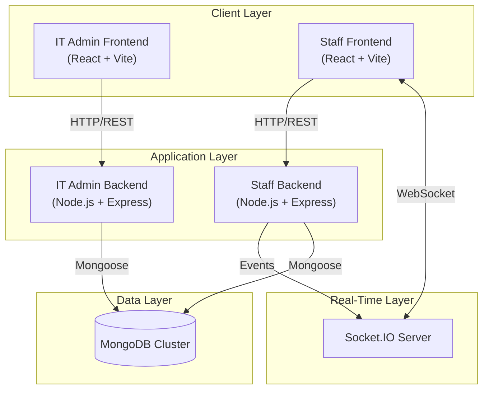
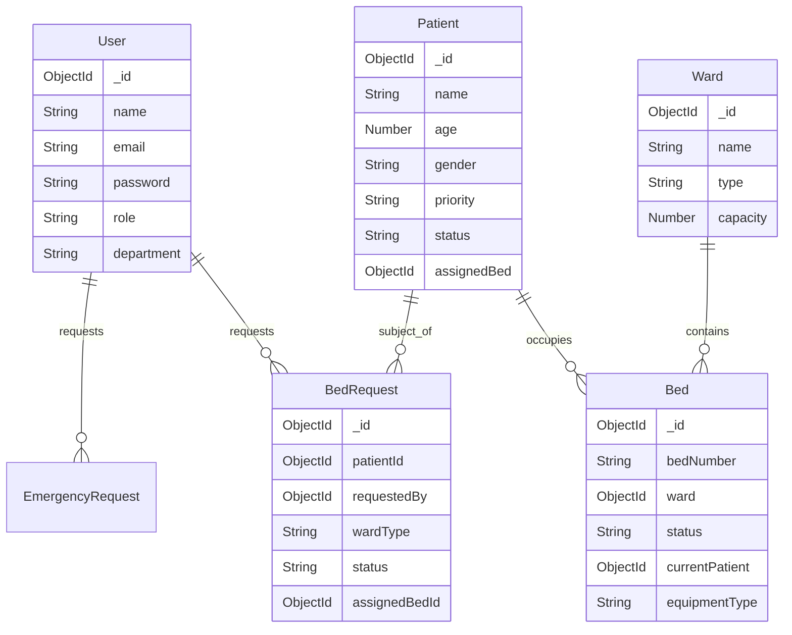

# 📘 Low-Level Design (LLD) - Hospital Bed & Patient Management System

## 1. Introduction
This document provides the detailed Low-Level Design (LLD) for the Hospital Bed & Patient Management System. It serves as a blueprint for the implementation, detailing the system architecture, database schema, component interactions, and security models.

### 1.1 Purpose
To provide a scalable, real-time solution for managing hospital bed occupancy, patient admissions, and emergency workflows, ensuring efficient resource utilization and rapid response times.

### 1.2 Scope
*   **User Management**: Role-based access for Admins, Managers, and Staff.
*   **Bed Management**: Real-time tracking of bed status (Available, Occupied, Cleaning, Maintenance).
*   **Patient Management**: Admission, discharge, and transfer workflows.
*   **Emergency Response**: Rapid bed allocation for critical patients.
*   **Reporting**: Utilization analytics and forecasting.

---

## 2. System Architecture

The system follows a **Microservices-inspired Monolithic Architecture** (Modular Monolith) with separate frontend and backend services for distinct operational domains (IT Admin vs. Hospital Staff).

### 2.1 High-Level Architecture Diagram

---

## 3. Technology Stack

| Component | Technology | Description |
| :--- | :--- | :--- |
| **Frontend** | React.js (Vite) | SPA with functional components and hooks. |
| **Styling** | Tailwind CSS / CSS | Responsive and modern UI design. |
| **State Mgmt** | React Context API | Managing auth state and socket connections. |
| **Backend** | Node.js + Express | RESTful API services. |
| **Database** | MongoDB | NoSQL database for flexible schema design. |
| **Real-Time** | Socket.IO | Bi-directional communication for live updates. |
| **Auth** | JWT (JSON Web Tokens) | Stateless authentication. |
| **Security** | bcryptjs | Password hashing. |

---

## 4. Database Design

The database is normalized to support data integrity while leveraging MongoDB's document model for performance.

### 4.1 Entity-Relationship (ER) Diagram

### 4.2 Key Collections

*   **Users**: Stores staff credentials and roles (`HOSPITAL_ADMIN`, `ICU_MANAGER`, `WARD_STAFF`, `ER_STAFF`).
*   **Patients**: Stores patient demographics, medical priority, and admission status.
*   **Beds**: Tracks bed availability, type, and current occupant.
*   **Wards**: logical grouping of beds (ICU, General, Emergency).
*   **BedRequests**: Formal requests for bed allocation (Standard workflow).
*   **EmergencyRequests**: High-priority requests for immediate allocation.

---

## 5. Component Design

### 5.1 IT Admin Service (`it-admin-backend`)
*   **Responsibility**: System configuration and user management.
*   **Key Modules**:
    *   `AuthModule`: Admin login.
    *   `UserModule`: CRUD operations for hospital staff accounts.

### 5.2 Staff Service (`staff-backend`)
*   **Responsibility**: Core hospital operations.
*   **Key Modules**:
    *   `AuthModule`: Staff login.
    *   `BedModule`: Bed CRUD, status updates, recommendation algorithm.
    *   `PatientModule`: Admission, discharge, patient details.
    *   `RequestModule`: Handling standard and emergency bed requests.
    *   `ReportingModule`: Generating occupancy and utilization reports.

---

## 6. Key Workflows & API Design

### 6.1 Emergency Bed Admission Flow

1.  **ER Staff** initiates request via Frontend.
2.  **Frontend** calls `POST /api/emergency-requests`.
3.  **Backend** checks `isEmergencyMode`.
    *   If `true`: Auto-assigns first available bed in ER/ICU.
    *   If `false`: Creates a pending request for Admin approval.
4.  **Backend** emits `emergency:new` or `patient:admitted` via Socket.IO.
5.  **Dashboards** update in real-time.

### 6.2 Bed Cleaning Workflow

1.  **Nurse** marks bed as "Cleaning" via `PATCH /api/beds/:id`.
2.  **Backend** updates status and sets `lastUpdated` timestamp.
3.  **Cron Job** runs every 15 mins to check for beds in "Cleaning" > 1 hour.
4.  **System** triggers alert if cleaning is overdue.

### 6.3 API Endpoints Summary

| Method | Endpoint | Description | Access |
| :--- | :--- | :--- | :--- |
| `POST` | `/api/auth/login` | Authenticate user | Public |
| `GET` | `/api/beds` | Get all beds | Auth |
| `PATCH` | `/api/beds/:id` | Update bed status | Staff |
| `POST` | `/api/patients` | Admit new patient | Staff |
| `POST` | `/api/emergency-requests` | Create emergency request | ER Staff |
| `PATCH` | `/api/bed-requests/:id/approve` | Approve bed request | Admin |
| `GET` | `/api/reports/utilization` | Get utilization stats | Admin/Manager |

---

## 7. Security Architecture

### 7.1 Authentication
*   **Mechanism**: JWT (JSON Web Tokens).
*   **Flow**: User logs in -> Server verifies credentials -> Server issues signed JWT -> Client sends JWT in `Authorization: Bearer` header.

### 7.2 Role-Based Access Control (RBAC)

| Role | Permissions |
| :--- | :--- |
| **IT_ADMIN** | Manage system users (Create/Delete Staff accounts). |
| **HOSPITAL_ADMIN** | View all data, Approve/Reject requests, View Reports. |
| **ICU_MANAGER** | Manage ICU beds, View Dashboard, Request beds. |
| **WARD_STAFF** | Update bed status (Cleaning/Available), View Ward data. |
| **ER_STAFF** | Create Emergency Requests, View ER availability. |

---

## 8. Real-Time Communication

The system uses **Socket.IO** to push updates to connected clients, eliminating the need for manual page refreshes.

### 8.1 Events

*   `bed:updated`: Fired when a bed's status changes (e.g., Available -> Occupied).
*   `patient:admitted`: Fired when a new patient is admitted.
*   `patient:discharged`: Fired when a patient is discharged.
*   `emergency:new`: Fired when a new emergency request is created.
*   `bed-request-approved`: Fired when an admin approves a request.

---

## 9. Deployment & Infrastructure

*   **Environment**: Node.js Runtime.
*   **Process Management**: PM2 or Docker Containers.

*   **Database**: MongoDB Atlas (Cloud) or Self-Hosted Cluster.
*   **CI/CD**: GitHub Actions (Conceptual) for automated testing and deployment.
